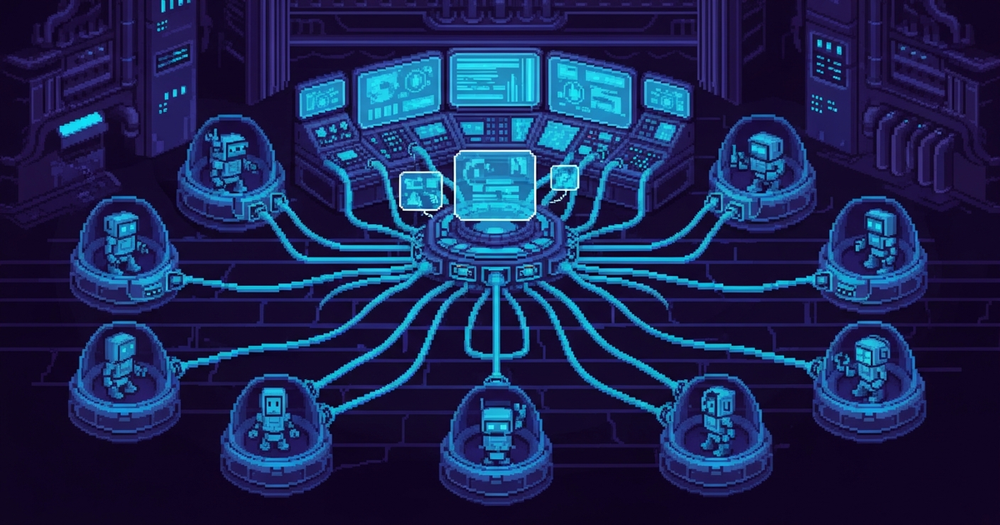

<div align="center">



# agent-pool

**Persistent multi-agent orchestration with prompt caching**

[](https://nodejs.org)
[](https://claude.com/claude-code)
[](LICENSE)
[](https://forthebadge.com)

**Spawn agents once, reuse indefinitely. 90% token savings via prompt caching.**

</div>

---

## Quick Start

```javascript
// Warm up agent (spawns once, caches system prompt)
mcp__agent-pool__warmup({ agent: "code-reviewer" })

// Task 1: ~2000 tokens (cache created)
mcp__agent-pool__invoke({
  agent: "code-reviewer",
  task: "Review src/auth.js for security issues"
})

// Task 2: ~300 tokens (system cached!)
mcp__agent-pool__invoke({
  agent: "code-reviewer",
  task: "Review src/api.ts for validation"
})

// Task 3: ~300 tokens (still cached)
mcp__agent-pool__invoke({
  agent: "code-reviewer",
  task: "Review src/db.js for SQL injection"
})

// Total: ~2,600 tokens vs 6,000 with native Task tool
```

## The Problem

Claude Code's native `Task` tool spawns a fresh process for **each task**:

```
Task 1: 2000 tokens (full system + task)
Task 2: 2000 tokens (full system + task) ← Duplicated!
Task 3: 2000 tokens (full system + task) ← Duplicated!
───────────────────────────────────────
Total:  6000 tokens (expensive)
```

**agent-pool solution:** Keep one process alive, reset context with `/clear`, reuse the cached system prompt.

```
Task 1: 2000 tokens (system + task, cache created)
Task 2:  300 tokens (task only, system cached!)
Task 3:  300 tokens (task only, system cached!)
───────────────────────────────────────
Total:  2600 tokens (88% savings)
```

## Features

- ✅ **Persistent agents** – Spawn once, reuse across tasks indefinitely
- ✅ **Prompt caching** – Same process = system prompt cached = ~90% savings on 2nd+ calls
- ✅ **Context reset** – `/clear` resets conversation without killing process (keeps cache warm)
- ✅ **Multi-agent pool** – Manage multiple concurrent agents with simple MCP interface
- ✅ **Pre-warming** – Spawn agents ahead of time for zero-latency first invocations
- ✅ **Legacy blocker** – Built-in hook prevents expensive native `Task` tool calls
- ✅ **Skills/Expertise** – Inject reusable knowledge from markdown files

## Installation

### Prerequisites
- **Claude CLI** 2.0+ with stream-json support
- **Node.js** 18+

### Install

```bash
# Clone into plugins directory
git clone https://github.com/sceat/agent-pool.git ~/.claude/plugins/agent-pool

# Install MCP server
cd ~/.claude/plugins/agent-pool/servers/agent-pool
npm install

# Restart Claude Code
```

## MCP Tools

| Tool | Purpose |
|------|---------|
| `invoke(agent, task)` | Send task, get result, auto-reset context |
| `list()` | Show active agents with PIDs |
| `warmup(agent)` | Pre-spawn to warm up cache |
| `reset(agent)` | Kill agent, respawn on next invoke |

**→ See [docs/USAGE.md](docs/USAGE.md) for detailed examples**

## Building Custom Agents

Create `/agents/my-agent.md` with your system prompt:

```markdown
---
name: my-agent
description: Brief description
---

# My Agent

## Identity
You are a [role]. Your expertise includes [skills].

## Conventions
| Aspect | Convention |
|--------|-----------|
| Style | Description |

## Guardrails
<always>
- Always do X
</always>

<never>
- Never do Y
</never>
```

Then invoke:
```javascript
mcp__agent-pool__invoke({ agent: "my-agent", task: "..." })
```

**→ See [docs/USAGE.md](docs/USAGE.md) for complete agent creation guide**

## Token Savings at Scale

| Scenario | Cost | Savings |
|----------|------|---------|
| 1 task | 2,000 | 0% |
| 3 tasks | 2,600 | 57% |
| 5 tasks | 3,100 | 74% |
| 10 tasks | 3,600 | 82% |

*Example: Code reviewer running 5 reviews = $0.15 saved vs native Task*

## Documentation

- **[Installation Guide](docs/INSTALLATION.md)** – Step-by-step setup
- **[Usage & Examples](docs/USAGE.md)** – API reference, examples, agent creation
- **[Architecture](docs/ARCHITECTURE.md)** – How it works internally
- **[Troubleshooting](docs/TROUBLESHOOTING.md)** – Common issues

## How It Works

1. **Persistent process** – Spawns Claude CLI once per agent
2. **Prompt cache** – System prompt cached after 1st request (~90% token savings on reads)
3. **Context reset** – `/clear` clears conversation, keeps process + cache alive
4. **Pool management** – MCP server coordinates multiple agents

[↑ Back to top](#agent-pool)

## Contributing

New agents, fixes, and docs are welcome! See [CONTRIBUTING.md](CONTRIBUTING.md).

## License

[MIT License](LICENSE) – See LICENSE file for details.

---

**Made with ❤️ for Claude Code developers**
